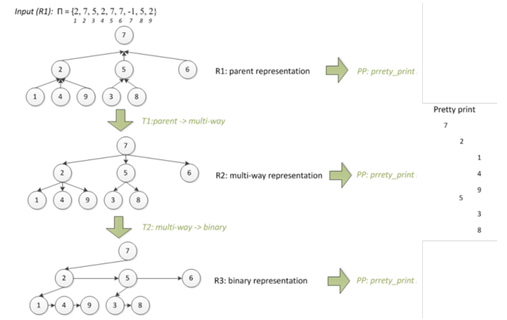

# Assignment 6: Multi-way Trees & Representation Transforms

**Allocated time:** 2 hours

## 1. Implementation

1.  You are required to implement correctly and efficiently **iterative and recursive binary tree traversal**. You may find any necessary information and pseudo-code in your course and seminar notes.

2.  Moreover, the correct and efficient implementation of **linear complexity algorithms** is required for transforming multi-way trees between the following representations:
    1.  **R1: Parent representation**: for each index, the value in the vector represents the parent's index, e.g.: `Π = {2, 7, 5, 2, 7, 7, −1, 5, 2}`
    2.  **R2: Multi-way tree representation**: each node contains the key and a vector of child nodes.
    3.  **R3: Binary representation**: each node contains the key and two pointers, one to the first child and the second to the right sibling (e.g., the next sibling).

Therefore, you need to define transformation **T1** from the parent representation (R1) to the multi-way tree representation (R2), and then the transformation **T2** from the multi-way tree representation (R2) to the binary representation (R3). For all representations (R1, R2, R3), you need to implement the **Pretty Print (PP)** display.

Define the data structures. You can use intermediate structures (e.g., additional memory).

## 2. Minimal Requirements for Grading

The lack of any of the minimum requirements (even partially) may result in a lower grade through penalties or refusal to accept the assignment, resulting in a grade of 0.

*   **Demo**: Prepare a demonstration of correctness for each algorithm implemented. The correctness of each algorithm is demonstrated through a simple example (maximum 10 values).
*   The charts created must be easy to evaluate, grouped, and added through the Profiler functions as specified by the assignment requirements. The assignment will not be evaluated if it contains a plethora of ungrouped charts. For example, the comparative analysis implies the grouping of the compared algorithms.
*   Interpret the chart and write your observations in the header (block comments) section at the beginning of your `main.cpp` file.
*   We do not accept assignments without code indentation and with code not organized in functions (for example, where the entire code is in the `main` function).
*   The points from the requirements correspond to a correct and complete solution, quality of interpretation from the block comment, and the correct answer to the questions from the teacher.

## 3. Requirements

### 3.1. Iterative and Recursive Binary Tree Traversal (3p)

*   Implement iterative and recursive binary tree traversal in O(n) and with constant additional memory.
*   **Demo**: You will have to prove your algorithm(s) work on a small-sized input.

### 3.2. Pretty-print for R1 (2p)

*   Correct implementation for Pretty-print for R1.
*   **Demo**: The correctness of the algorithms should be demonstrated using the example `Π = {2, 7, 5, 2, 7, 7, −1, 5, 2}`.

### 3.3. Transformation T1 (R1 to R2) and Pretty-print for R2 (2p)

*   Correct implementation for T1 (from R1 to R2) and pretty-print for R2 (1p).
*   T1 must be in linear time (1p).
*   **Demo**: The correctness of the algorithms should be demonstrated using the example `Π = {2, 7, 5, 2, 7, 7, −1, 5, 2}`.

### 3.4. Transformation T2 (R2 to R3) and Pretty-print for R3 (3p)

*   Correct implementation for T2 (from R2 to R3) and pretty-print for R3 (2p).
*   T2 must be in linear time (1p).
*   **Demo**: The correctness of the algorithms should be demonstrated using the example `Π = {2, 7, 5, 2, 7, 7, −1, 5, 2}`.

---

Use Pretty Print for all three representations. Each representation (R1, R2, R3) should have a pretty print of its own with a different implementation but with the same print.

Analyse the time and space efficiency of the two transformations. Did you achieve O(n)? Did you use additional memory?